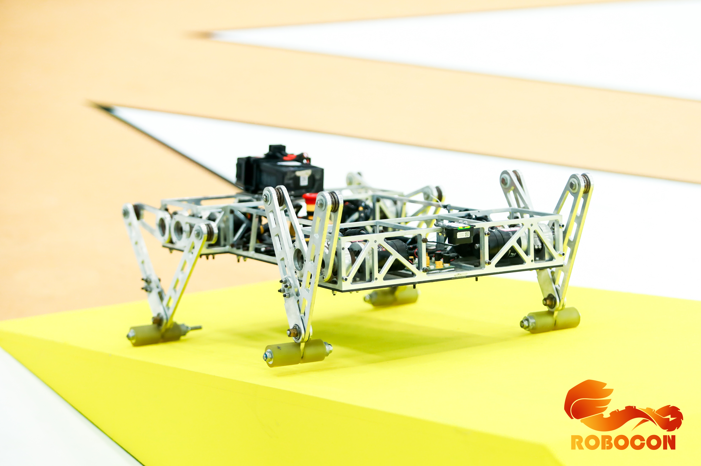

# ROBOCON2024-3508DOG
Initial version developed by MTI Robotics Team, Fujian University of Technology in 2022. Iterated in 2022-2024, this DJI 3508-powered quadruped robot supports control via DJI DT7+DR16 receiver or computer keyboard (with DT7 as signal transmitter).

## 🚀 Project Overview

This project originated from the F427 basic architecture of the Robocon 2020 chassis, and officially transformed into a **quadruped robot** control program architecture after version V1.0. The core objectives are to achieve stable standing, gait control, sensor fusion of the quadruped robot, and ultimately realize autonomous or remote-controlled movement in track environments.

## 📜 Version Iteration Records

### Phase 1: Basic Chassis Architecture (V0.x)

The goal of this phase is to build a clean and stable F427 underlying platform to provide a solid foundation for subsequent complex robot projects.

| Version | Description | Main Features/Modifications |
| :--- | :--- | :--- |
| **V0.0** | Establishment of basic blank architecture | Based on the Robocon 2020 chassis, removed redundant functions, fixed warnings, and built the F427 underlying architecture. |
| **V0.1** | Code standardization | Modified most function names for ease of use; improved functions; completed comments. |
| **V0.2** | RC/Keyboard control integration | Modified the `remote` file and added keyboard control options (requires RoboMaster client). |
| **V0.3** | LiDAR integration | Added LiDAR module, connected to **Serial Port 6**. |
| **V0.4** | Preliminary integration of positioning system (WiFi) | Added positioning system functions; `Rabbit` structure; WiFi reception (Serial Port 7); zero reset transmission (Serial Port 8). |
| **V0.5** | Chassis rotation and self-made remote control | Optimized chassis rotation; added self-made 2.4G remote control (**Serial Port 2**). |
| **V0.6** | Hardware upgrade of positioning system | Removed WiFi, added RS485 absolute encoder base-axis positioning system based on C8T6 (**Serial Port 7**). |

-----

### Phase 2: Quadruped Robot Architecture (V1.x - V2.x)

This phase is the core of the project, focusing on the implementation of motion control, balance, and gait algorithms for the quadruped robot.

| Version | Description | Main Features/Modifications |
| :--- | :--- | :--- |
| **V1.0** | **Project transformation and motor allocation** | **Established the program with quadruped robot as the core project**, and allocated motors for each joint. |
| **V1.1** | **PID library and function reconstruction** | Modified the original function `M3508_ParaInit(void)` to:<br>**`M3508_ParaInit(Leg_speed_PID speed[], Leg_position_PID position[])`** to achieve **variable PID**.<br>Added remote control functions and **PID library**. |
| **V1.2** | Architecture file update | Added underlying architecture files updated to version V0.3. |
| **V1.3** | Implementation of standing function | Realized the basic **standing function** of the quadruped robot. |
| **V1.4** | Attitude balance (Gyroscope) | Added **gyroscope-based anti-fall standing function** to achieve basic attitude control. |
| **V1.5** | Attitude balance (LiDAR) | **Added LiDAR** to maintain a fixed height, aiming to solve the **backward tilting problem** during standing. |
| **V1.6** | Reconstruction of keyboard control logic | **Modified keyboard control logic** and partial control functions to adapt to quadruped robot movement. |
| **V1.7** | Gait exploration and frame number measurement | **Started frame number measurement**, and performed incremental adjustments on the basis of balance to **enable walking**. |
| **V1.8** | Introduction of time frame | Added **time frame** (start of operation) for gait timing control. |
| **V1.81** | Frame compensation algorithm | Added **frame compensation algorithm** to optimize the smoothness of gait movement. |
| **V1.9** | Keyboard logic and motion expansion | Modified keyboard logic, added **forward rotation function** (backward rotation to be added), and continued measuring frame angles. |
| **V2.0** | Logic and behavior optimization | Set sampling monitoring to 8, optimized logic and operation behavior (competition preparation phase). |
| **V2.1** | Addition of backward gait | **Added backward gait function** to realize the backward movement of the robot. |
| **V2.2** | Preset height and turning | Added **preset height** and **turning function** (PID for preset state not yet implemented). |
| **V2.3** | Track testing | Conducted track testing (**differential decision-making and jumping function**). |
| **V2.4** | Turning optimization | **Modified turning method** with improved speed. |
| **V2.5** | Track testing and improvement | Track testing improvements: **reduce height** when going down slopes; right turn assigned to Q key (not yet modified). |
| **infinity** | **Final competition testing** | **Only debugging is performed, no additional algorithms or hardware are added.** Recorded on 2023.7.2 by_kizuna |

-----

## 🛠️ Technical Implementation and Notes

### 1. M3508 Motor Parameter Initialization

In version V1.1, to achieve **variable PID**, the motor initialization function has been reconstructed and can now receive PID structure arrays as parameters, facilitating dynamic switching of control parameters in different gaits or states.

```c
// V1.1 version function declaration
void M3508_ParaInit(Leg_speed_PID speed[], Leg_position_PID position[]);
```

**【Important Note】**

When calling this function with a structure array, you must use the address operator `&` to pass the address of the first element of the array:

```c
// Example call:
M3508_ParaInit(&state_kara_speed[0], &state_kara_position[0]);
```

### 2. Structure Sharing

Structures declared and shared in `.h` files (such as those for PID parameters, remote control data, and positioning data) can be directly used anywhere in the project to ensure data consistency.

## 💡 Maintenance and Messages

This project has undergone a transformation from a basic chassis to a complex quadruped robot, reflecting the relentless efforts and pursuit of excellence of the electronic control team.

> **Message from kizuna (2023 ROBOCON Electronic Control):**
>
> **No matter how difficult it is, we refuse to give up. Chasing dreams is exactly the challenge for us** ――《LoveLive!》

> **Message from Liangchen Jason (2024 ROBOCON Electronic Control):**
>
> **Improve architecture files, add functions, refine and enhance their capabilities, and carry out version iteration.**

> **Message from Ming (Recorded on 2024.7.8):**
>
> **Keep your heart focused on the goal, and with consistent effort day after day, progress is inevitable.**

# Original Turning Data
// Left Turn
float go_left1[8]={0,26,42,-18,-99,-106,-49,-2};//
float go_left2[8]={0,39,52,93,111,30,-8,-17};//
float go_left3[8]={99,18,-42,-26,0,2,49,106};//
float go_left4[8]={-111,-93,-52,-39,0,17,8,-30};//

float go_left5[8]={111,83,52,39,0,-17,-8,30};//
float go_left6[8]={-99,-18,42,26,0,-2,-49,-106};//
float go_left7[8]={0,-39,-52,-83,-111,-30,8,17};//
float go_left8[8]={0,-26,-42,18,99,106,49,2};//
// Right Turn
float go_right1[8]={0,-2,-49,-106,-99,-18,42,26};//
float go_right2[8]={0,-17,-8,30,111,93,52,39};
float go_right3[8]={99,106,49,2,0,-26,-42,18};
float go_right4[8]={-111,-30,8,17,0,-39,-52,-93};

float go_right5[8]={111,30,-8,-17,0,39,52,83};//
float go_right6[8]={-99,-106,-49,-2,0,26,42,-18};//
float go_right7[8]={0,17,8,-30,-111,-83,-52,-39};
float go_right8[8]={0,2,49,106,99,18,-42,-26};

# New Turning Data (Based on Step State)
// Left
float Ttabu1[8]={0,-40,-80,-129,-142,-44,-16,14};
float Ttabu2[8]={0,-28,-25,11,111,100,52,26};
float Ttabu3[8]={73,77,39,5,0,-46,-31,19};
float Ttabu4[8]={-101,-8,18,37,0,-26,-55,-121};

float Ttabu5[8]={73,77,39,5,0,-46,-31,19};
float Ttabu6[8]={-101,-8,18,37,0,-26,-55,-121};
float Ttabu7[8]={0,-40,-79,-129,-142,-44,-16,14};
float Ttabu8[8]={0,-28,-25,11,111,100,52,26};

// Right
float Ttabu1[8]={0,26,42,-18,-99,-106,-49,-2};
float Ttabu2[8]={0,39,52,93,111,30,-8,-17};
float Ttabu3[8]={100,75,50,25,0,25,50,75};
float Ttabu4[8]={-100,-75,-50,-25,0,-25,-50,-75};

float Ttabu5[8]={100,75,50,25,0,25,50,75};
float Ttabu6[8]={-100,-75,-50,-25,0,-25,-50,-75};
float Ttabu7[8]={0,26,42,-18,-99,-106,-49,-2};
float Ttabu8[8]={0,39,52,93,111,30,-8,-17};
**Modification Date: 2024/6/22**
// Right
float Ttabu1[8]={0,26,42,-18,-99,-106,-49,-2};
float Ttabu2[8]={0,39,52,93,111,30,-8,-17};
float Ttabu3[8]={100,8,-16,36,0,26,54,115};
float Ttabu4[8]={-100,-90,-49,-5,0,46,31,-19};

float Ttabu5[8]={100,8,-16,36,0,26,54,115};
float Ttabu6[8]={-100,-90,-49,-5,0,46,31,-19};
float Ttabu7[8]={0,26,42,-18,-99,-106,-49,-2};
float Ttabu8[8]={0,39,52,93,111,30,-8,-17};
**Modification Date: 2024/6/30**

# ROBOCON2024-3508DOG
由福建理工大学MTI机器人队于2022年设计初版，2022、2023、2024迭代，使用大疆3508电机的机械狗。可通过大疆DT7+DR16接收机或者使用DT7作为信号发射器通过电脑键盘遥控。

## 🚀 项目简介

本项目起始于 Robocon 2020 底盘的 F427 基础架构，在 V1.0 版本后正式转型为**四足机器人**的控制程序架构。核心目标是实现四足机器人的稳定站立、步态控制、传感器融合，并最终实现赛道环境下的自主或遥控运动。

## 📜 版本迭代记录

### 阶段一：基础底盘架构 (V0.x)

此阶段的目标是建立一个干净、稳定的 F427 底层平台，为后续复杂的机器人项目提供坚实基础。

| 版本 | 描述 | 主要功能/修改 |
| :--- | :--- | :--- |
| **V0.0** | 基础空白架构建立 | 基于 Robocon 2020 底盘，去除功能，修缮警告，建立 F427 底层架构。 |
| **V0.1** | 代码规范化 | 修改大部分函数名，使其使用方便；完善函数；完善注释。 |
| **V0.2** | RC/键盘控制集成 | 修改 `remote` 文件，加入键盘控制选项（需使用 RoboMaster 客户端）。 |
| **V0.3** | 激光雷达集成 | 加入激光雷达模块，放于**串口 6**。 |
| **V0.4** | 定位系统初步集成 (WiFi) | 加入定位系统功能；`Rabbit` 结构体；WiFi 接收（串口 7）；归零发送（串口 8）。 |
| **V0.5** | 底盘旋转与自制遥控 | 优化底盘旋转；加入自制 2.4G 遥控（**串口 2**）。 |
| **V0.6** | 定位系统硬件升级 | 删除 WiFi，加入基于 C8T6 的 RS485 绝对值编码器基轴定位系统（**串口 7**）。 |

-----

### 阶段二：四足机器人架构 (V1.x - V2.x)

此阶段是项目的核心，聚焦于四足机器人的运动控制、平衡和步态算法实现。

| 版本 | 描述 | 主要功能/修改 |
| :--- | :--- | :--- |
| **V1.0** | **项目转型与电机分配** | **建立以四足机器人为项目的程序**，并分配好各关节电机。 |
| **V1.1** | **PID 库与函数重构** | 修改原函数 `M3508_ParaInit(void)` 为：<br>**`M3508_ParaInit(Leg_speed_PID speed[], Leg_position_PID position[])`**，实现**可变 PID**。<br>加入遥控控制函数和**PID 库**。 |
| **V1.2** | 架构文件更新 | 加入更新至 V0.3 版本的底层架构文件。 |
| **V1.3** | 站立功能实现 | 实现四足机器人基本的**站立功能**。 |
| **V1.4** | 姿态平衡\*\*（陀螺仪）\*\* | 加入**陀螺仪站立不倒**功能，实现基础姿态控制。 |
| **V1.5** | 姿态平衡\*\*（激光雷达）\*\* | **增加激光雷达**维持一定高度，欲解决站立时的**后倾问题**。 |
| **V1.6** | 键盘控制逻辑重构 | **修改键盘控制逻辑**，以及部分控制函数，以适应四足机器人运动。 |
| **V1.7** | 步态探索与帧数测量 | **开始进行帧数测量**，在平衡的基础上进行加法，**欲使其可以走路**。 |
| **V1.8** | 时间帧引入 | 加入**时间帧**（开始运行）作为步态时序控制。 |
| **V1.81** | 补帧算法 | 加入**补帧算法**，优化步态运动的平滑性。 |
| **V1.9** | 键盘逻辑与运动扩展 | 修改键盘逻辑，加入可以**前转功能**（后转待加入），继续测量帧数角。 |
| **V2.0** | 逻辑与行为优化 | 监测采样 8，优化逻辑以及运行行为（备赛阶段）。 |
| **V2.1** | 后步态加入 | **后步态**功能加入，实现机器人的后退运动。 |
| **V2.2** | 预设与转弯 | 加入**预设高度**，以及**转弯功能**（预设状态 PID 尚未进行）。 |
| **V2.3** | 赛道测试 | 进行赛道测试（**差决策以及跳跃功能**）。 |
| **V2.4** | 转弯优化 | **修改转弯方式**，速度有所提升。 |
| **V2.5** | 赛道测试与改进 | 赛道测试改进：下斜坡时应**降低高度**；右转为 Q 键尚未更改。 |
| **infinity** | **比赛最终测试** | **仅进行调试，不再加入算法以及其他硬件。** 记录于 2023.7.2 by\_kizuna |

-----

## 🛠️ 技术实现与注意事项

### 1\. M3508 电机参数初始化

在 V1.1 版本，为了实现**可变 PID**，电机初始化函数已被重构，现可接收 PID 结构体数组作为参数，方便在不同步态或状态下动态切换控制参数。

```c
// V1.1 版本函数声明
void M3508_ParaInit(Leg_speed_PID speed[], Leg_position_PID position[]);
```

**【重要提示】**

在使用结构体数组调用此函数时，必须使用指向符 `&` 传递数组首元素的地址：

```c
// 示例调用：
M3508_ParaInit(&state_kara_speed[0], &state_kara_position[0]);
```

### 2\. 结构体共享

位于 `.h` 文件中声明并共享的结构体（如用于 PID 参数、遥控数据、定位数据的结构体）可以在项目的任何地方直接使用，确保数据的一致性。

## 💡 维护与寄语

本项目经历了从基础底盘到复杂四足机器人的转型，体现了电控团队不懈的努力和追求卓越的精神。

> **kizuna (2023 ROBOCON 电控) 赠语:**
>
> **无论多么艰难也不愿放弃，追梦正是对我们的挑战** ――《lovelive》

> **良辰Jason (2024 ROBOCON 电控) 赠语:**
>
> **完善架构文件，加入功能，并对其修缮提升其功能，进行版本迭代。**

> **詺 (2024.7.8 记录) 寄语:**
>
> **心有所向，日复一日，必有精进。**
# 原转弯数据
//左转
float go_left1[8]={0,26,42,-18,-99,-106,-49,-2};//
float go_left2[8]={0,39,52,93,111,30,-8,-17};//
float go_left3[8]={99,18,-42,-26,0,2,49,106};//
float go_left4[8]={-111,-93,-52,-39,0,17,8,-30};//

float go_left5[8]={111,83,52,39,0,-17,-8,30};//
float go_left6[8]={-99,-18,42,26,0,-2,-49,-106};//
float go_left7[8]={0,-39,-52,-83,-111,-30,8,17};//
float go_left8[8]={0,-26,-42,18,99,106,49,2};//
//右转
float go_right1[8]={0,-2,-49,-106,-99,-18,42,26};//
float go_right2[8]={0,-17,-8,30,111,93,52,39};
float go_right3[8]={99,106,49,2,0,-26,-42,18};
float go_right4[8]={-111,-30,8,17,0,-39,-52,-93};

float go_right5[8]={111,30,-8,-17,0,39,52,83};//
float go_right6[8]={-99,-106,-49,-2,0,26,42,-18};//
float go_right7[8]={0,17,8,-30,-111,-83,-52,-39};
float go_right8[8]={0,2,49,106,99,18,-42,-26};
转弯的新数据（基于踏步状态）
//Left
float Ttabu1[8]={0,-40,-80,-129,-142,-44,-16,14};
float Ttabu2[8]={0,-28,-25,11,111,100,52,26};
float Ttabu3[8]={73,77,39,5,0,-46,-31,19};
float Ttabu4[8]={-101,-8,18,37,0,-26,-55,-121};

float Ttabu5[8]={73,77,39,5,0,-46,-31,19};
float Ttabu6[8]={-101,-8,18,37,0,-26,-55,-121};
float Ttabu7[8]={0,-40,-79,-129,-142,-44,-16,14};
float Ttabu8[8]={0,-28,-25,11,111,100,52,26};

//Right
float Ttabu1[8]={0,26,42,-18,-99,-106,-49,-2};
float Ttabu2[8]={0,39,52,93,111,30,-8,-17};
float Ttabu3[8]={100,75,50,25,0,25,50,75};
float Ttabu4[8]={-100,-75,-50,-25,0,-25,-50,-75};

float Ttabu5[8]={100,75,50,25,0,25,50,75};
float Ttabu6[8]={-100,-75,-50,-25,0,-25,-50,-75};
float Ttabu7[8]={0,26,42,-18,-99,-106,-49,-2};
float Ttabu8[8]={0,39,52,93,111,30,-8,-17};
**修改时间2024/6/22**
//Right
float Ttabu1[8]={0,26,42,-18,-99,-106,-49,-2};
float Ttabu2[8]={0,39,52,93,111,30,-8,-17};
float Ttabu3[8]={100,8,-16,36,0,26,54,115};
float Ttabu4[8]={-100,-90,-49,-5,0,46,31,-19};

float Ttabu5[8]={100,8,-16,36,0,26,54,115};
float Ttabu6[8]={-100,-90,-49,-5,0,46,31,-19};
float Ttabu7[8]={0,26,42,-18,-99,-106,-49,-2};
float Ttabu8[8]={0,39,52,93,111,30,-8,-17};
**修改时间2024/6/30**
